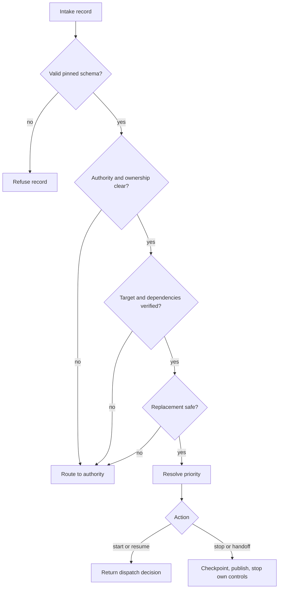

# Task intake and urgent-owner priority

**Status:** corrected v1.2 candidate; pending final acceptance on issue #2 before resolver implementation.
**Leaf issue:** [#2](https://github.com/Pukujan/multi-agent-modules/issues/2); parent: none; task: MAM-0002.
**Decision authority:** `/root` (Codex, appointed by the project owner in this task).
**Scope:** define the intake and deterministic routing contract. This document does not authorize a full launcher, agent transport, task DAG, or checkpoint service.

## Problem and outcome

A fresh agent must know which repository it serves, which lane and task it owns, who authorized the work, what the current checkpoint says, and whether its own goals or scheduled jobs are active. Without one versioned record, an urgent owner stop can lose to an old priority or an agent's standing goal, and a new session can replace the wrong provider or start beside a still-writing session.

This contract makes those facts explicit and routes ambiguous records to review without dispatch. A small resolver can apply the policy deterministically; it has no authority to stop sessions or change GitHub state itself.

## Precedence order

The highest applicable level wins. Level 0 is a safety constraint; it can veto work but does not schedule it.

| Level | Source | Effect |
| --- | --- | --- |
| 0 | Platform/system safety and recorded authorization boundaries | Veto any action that violates them |
| 1 | Explicit urgent instruction from the repository owner, or a recorded owner delegate | Overrides ordinary task priority, active goals, and continuation instructions within this repository and runtime lane |
| 2 | Recorded project-authority decision on the target issue | Sets the issue's accepted scope, owner, and sequencing, subject to level 1 |
| 3 | GitHub issue priority P0, P1, P2, or P3 | Orders work the recipient owns |
| 4 | The recipient's own active goal or standing continuation instruction | Continues ordinary work when higher levels do not decide it |
| 5 | Ambient work with no issue backing | May use idle capacity |

An urgent owner stop still requires a recoverable checkpoint before the agent stops. It cannot override platform safety, exceed the owner's project authority, or affect a different runtime lane. An owner delegate can invoke level 1 only when the delegation is recorded. An arbiter decision, a worker's urgency claim, and an agent's own goal cannot produce level 1.

## Intake record

The corrected JSON Schema is [`task-intake.schema.json`](../schemas/mam/v1/task-intake.schema.json). It uses JSON Schema 2020-12 and pins `schema_version` to `mam.task-intake.v1.2`. Unknown versions are refused; the resolver never guesses a migration. Issue comment [#5852850796](https://github.com/Pukujan/multi-agent-modules/issues/2#issuecomment-5852850796) records the pre-implementation correction from one replacement to an explicit list of every prior same-lane session.

Every record includes:

| Field | Required facts |
| --- | --- |
| `target` | Canonical `owner/repo`, verified origin remote, canonical-checkout status, and issue reference |
| `lane` | Provider lane, stable agent alias, and `replacements` listing every older same-lane session assigned to this repository; an empty list means none |
| `requester` | Authority, recorded delegation reference when applicable, and urgency claim |
| `action` | `start`, `resume`, `handoff`, or `stop` |
| `task` | Issue owner, recipient owner, role, bounded scope, base priority, and dependencies (an empty list explicitly means none) |
| `checkpoint` | Explicit `none`, `published`, or `unavailable` state; a published checkpoint includes its commit and issue |
| `automation` | At least one explicit state for the recipient's goals, scheduled jobs, and watchdogs. Use a verified `not_installed` entry when a category has no controls |
| `authorization` | Repository-write and self-automation authority; `may_stop_other_lanes` is always false |

Goal states distinguish `active` from `paused`; scheduled-job and watchdog states distinguish `active` from `stopped`. Each record includes exact pause/stop and restart actions. `not_installed` is explicitly verified. `unavailable` or `unknown` is recorded honestly and causes fail-closed routing until the state is known. After a handoff or stop plan runs, the goal must be recorded as paused and the recipient's active jobs/watchdogs as stopped.

## Deterministic routing

The resolver processes a record in this order:

1. Validate the complete record against the pinned schema. An invalid record or unsupported version is refused without inferring missing values.
2. Verify the target remote and require `checkout_role: canonical`. The resolver receives those observations from the checkout/PCM caller; an unverified remote, collision, or unresolved checkout routes to the project authority. Do not clone or dispatch.
3. Require known requester authority, a recorded and verified delegation for an urgent delegate, and matching issue, task, and lane ownership. The caller supplies the authenticated requester authority and canonical issue owner from GitHub. Unclear, unverified, or conflicting ownership routes to the project authority.
4. Require every dependency to appear in the caller's set of dependencies verified complete in GitHub. An unverified or incomplete dependency routes to the project authority.
5. Compare the intake's replacement list with the caller's complete list of older sessions in this provider lane assigned to this canonical repository. Require a published checkpoint and verified stop for every session. If any prior session is unreachable, its write authority must also be verified as fenced. Missing, extra, or cross-provider entries fail closed; the resolver never produces a stop action for another lane.
6. Resolve priority: an authorized urgent owner request becomes `urgent_owner`; otherwise use the task's GitHub priority P0–P3. A worker urgency claim leaves ordinary priority unchanged.
7. For `start` or `resume`, return a dispatch decision only if all prior checks pass. For `stop` or `handoff`, return an ordered plan to checkpoint, publish the handoff, pause the recipient's active goal, stop and verify the recipient's own active jobs/watchdogs, record restart actions, and then stop. A fresh start cannot proceed while a goal remains active or paused; a resume may take over only a verified stopped prior session and a non-active goal. The plan leaves the GitHub task open.

The resolver returns a decision and a plan; it performs no external actions. It requires a separately supplied verified-facts context for the remote/checkout observation, authenticated requester authority and delegation, canonical issue owner, completed dependencies, checkpoint publication, replacement stop/fence, and observed automation states. Matching fields inside the JSON record are claims until compared with that context. Missing or contradictory evidence fails closed. A caller must execute the returned plan through authorized PCM/GitHub operations and verify each result. An unresolved decision has no dispatch plan and names the reason. A refused schema record is distinct from a valid-but-unresolved record.

Text equivalent: validate; resolve authority and ownership; verify target and dependencies; verify any same-lane replacement; resolve priority; then return dispatch or checkpoint-and-stop instructions. This resolver does not itself launch or stop a session.

## Conflict behavior

- **Two agents claim one issue:** only the recorded issue owner may proceed. A conflicting or absent owner routes to the project authority; the resolver does not choose a winner based on arrival order.
- **A stop arrives mid-task:** publish a recoverable checkpoint, record the branch and commit, stop the recipient's own controls, and leave the task open.
- **Two possible checkouts exist:** preserve both and route the collision for resolution; never delete or clone to make the ambiguity disappear.
- **An owner instruction supersedes an authority decision:** the owner instruction wins within the level-0 and lane boundaries. Record the supersession on the issue before dependent work proceeds.
- **A different provider appears to block progress:** never stop or replace it. Resolve work through issue ownership, separate branches, and pull requests.
- **A prior same-lane session is unreachable:** do not dispatch unless every prior session has a recoverable checkpoint and verified stop, and the unreachable session's write authority is fenced.

## PCM boundary

PCM remains responsible for continuity validation, the per-device workspace registry, and `single-checkout`. This contract only records target verification and checkout role; it does not implement a second workspace manager, scan disks, create clones, or duplicate PCM schemas under `schemas/v1/`.

## Property checks

The resolver implementation must make these properties executable:

| Property | Required evidence |
| --- | --- |
| Authorized urgent owner stop wins over P0–P3 and the recipient's active goal | Resolver returns `urgent_owner` and a checkpoint-before-stop plan |
| Worker cannot promote its own work | `urgent: true` from a worker leaves P0–P3 unchanged |
| A worker cannot impersonate an owner in the intake record | An `owner` claim contradicted by the caller's authenticated GitHub authority yields no urgent priority or dispatch |
| Other runtime lanes are not stopped or replaced | Cross-lane replacement is refused and the stop plan contains only the recipient's own controls |
| Every prior same-lane session is accounted for | Omitting one discovered session from the replacement list yields no dispatch |
| Routing is deterministic | Repeated resolution and reordered input collections produce identical decisions |
| Ambiguous state fails closed | Invalid remote, checkout collision, unknown authority, owner mismatch, incomplete dependency, missing checkpoint, or unverified stop yields no dispatch |
| Automation absence is explicit | Empty arrays or unknown/unavailable states cannot yield dispatch |
| A goal pause is distinguishable from stopping a watchdog | Goal records use `paused`; scheduled-job and watchdog records use `stopped` |
| A stop does not close work | The returned plan explicitly leaves issue status unchanged |

Schema tests separately verify the draft-2020-12 meta-schema and reject an unsupported version, missing required state, invalid action, `may_stop_other_lanes: true`, and an automation entry without required state/actions. The JSON Schema validates shape, not authenticity; resolver tests supply trusted facts separately and prove that a record cannot promote itself by asserting `remote_verified`, `authority: owner`, or `verified: true` without matching observations.

## Acceptance mapping and limits

This contract supplies the human precedence order, intake schema, deterministic routing rules, conflict behavior, and properties requested by issue #2. The resolver tests will prove the policy behavior. The project-level acceptance still requires three observed fresh-session runs across multiple devices, including interruption recovery and a same-lane takeover while another runtime lane remains untouched. This document and unit tests do not claim those runs have happened. The complete cold-start runtime is not delivered by this contract.
