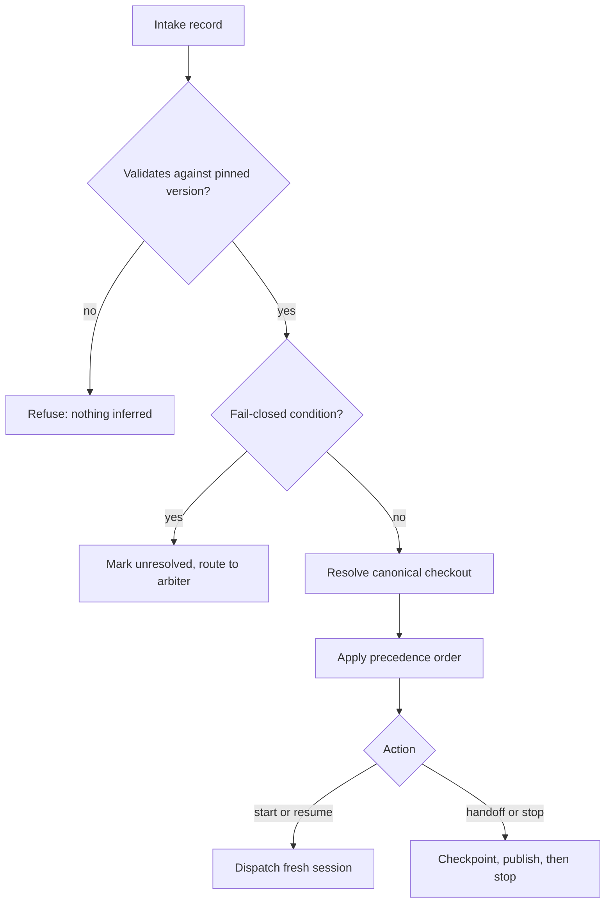

# Proposal 0001 — Task intake contract and urgent-owner priority

**Status: DRAFT PROPOSAL — not a decision, not accepted, do not merge.**
**For:** the owner-appointed local GPT session, the design arbiter for this repository.
**Addresses:** [issue #2](https://github.com/Pukujan/multi-agent-modules/issues/2).
**Author:** `claude-code-main` (Claude Code lane) — proposer only. `PROJECT.md` states that this session is not the design arbiter, so nothing here is authoritative.
**Version:** 0.1.0-draft.

## 1. Why this exists

The cold-start runtime has to carry roles and authority into a session that shares no memory with the session it replaces. Today nothing states which instruction wins when an owner says "stop" while a task, a goal, and a scheduled job all say "keep going". `PROJECT.md` records the missing piece as issue #2: a strict task classifier and a precedence rule for urgent owner instructions.

Without that rule the failure is concrete. An agent that ranks its own active goal above an owner stop keeps spending money and writing commits after the owner has paused the project; an agent that ranks a stop above everything else can abandon a half-written checkpoint and lose work. Both are avoidable with a stated order and one obligation — checkpoint before stopping.

This proposal offers the two artifacts issue #2 names as prerequisites to implementation: a **human-readable precedence order** and a **machine-readable intake schema**. It defines the rules and states the tests that would prove them. It deliberately implements no runtime.

## 2. Precedence order (human-readable)

Highest wins. Levels 0 and 1 are absolute; levels 2 to 5 order ordinary work.

| Level | Source | What it can do | What it cannot do |
| --- | --- | --- | --- |
| **0** | Platform/system safety and the repository's declared authorization boundaries | Veto any lower level | Be overridden by anything below it |
| **1** | An explicit, authorized **urgent owner instruction**, including any stop or handoff | Override levels 2 to 5, reorder work, or halt work | Override level 0 |
| **2** | A recorded **arbiter decision** on the target issue | Set scope, ownership, and sequencing for that issue | Override an owner instruction |
| **3** | **Issue-backed task priority** — P0, then P1, then P2, then P3 | Order work the recipient already owns | Displace level 1 or 2 |
| **4** | The recipient's own **active goal or standing continuation instruction** | Keep ordinary work moving | Outrank an issue-backed task |
| **5** | **Ambient or default work** with no issue backing | Fill idle capacity | Displace anything above it |

Level 0 is a constraint rather than a work item: it never schedules anything, it only forbids. Level 5 exists so that "no instruction" has a defined rank instead of an undefined one.

### Rules

- **R1 — Scope of precedence.** The order reorders work only within one *(canonical repository, runtime lane)* pair. It never reorders, stops, or replaces work in another lane.
- **R2 — Urgency is not self-declared.** A worker cannot raise its own priority by calling its work urgent. Only `requester.authority` of `owner`, or `owner_delegate` with `delegation_recorded: true`, can produce level 1.
- **R3 — A stop means "checkpoint, then stop".** Level 1 never authorizes abandoning work. A stop or handoff instruction obliges a recoverable checkpoint and a published record before the agent ceases.
- **R4 — Fail closed.** If the target repository, the requester's authority, or the issue ownership is unclear, the runtime does not act. It records `unresolved: true` with a plain-language reason and routes to the arbiter.
- **R5 — Replacement is same-lane and same-repo only.** A new session may take over an older session only when both the runtime lane and the canonical repository match, and only after the older session's checkpoint and stop are verified.
- **R6 — No concurrent same-lane writer.** If the older same-lane session is unreachable and its write authority cannot be shown to be fenced off, the replacement must not start.
- **R7 — Cross-vendor non-interference.** A session never stops or replaces a session in a different runtime/provider lane, whatever its own authority. This is encoded as a constant in the schema so a conforming record cannot even express the claim.
- **R8 — Deterministic resolution.** Given the same intake record, the resolved priority is the same every time. No rule depends on elapsed time, on a previous run's outcome, or on which agent is asking.

## 3. The intake contract

The machine-readable shape is [`task-intake.schema.json`](task-intake.schema.json) in this directory. It is a JSON Schema (draft 2020-12) with a pinned `schema_version` of `mam.task-intake.v0-draft`, so a bootstrap that does not implement this version must refuse the record rather than guess.

| Required field | Classifies |
| --- | --- |
| `target.canonical_repo`, `target.remote_verified`, `target.checkout_role` | The canonical target GitHub repository, and whether the checkout is the one canonical copy |
| `lane.provider`, `lane.agent_alias`, `lane.replaces_agent_alias` | The runtime/provider lane and the agent identity within it |
| `requester.authority`, `requester.delegation_recorded`, `requester.urgent` | The requester's authority to outrank ordinary priority |
| `action` | The task/action type: `start`, `resume`, `handoff`, or `stop` |
| `task.owner_agent_alias`, `task.scope` | The existing issue owner and scope |
| `task.depends_on` | Dependencies that must complete first |
| `priority` | The resolved priority, after the precedence order is applied |
| `automation.goals`, `automation.scheduled_jobs`, `automation.watchdogs` | The recipient's own active goal and repo-specific automation |
| `authorization.*` | What the recipient may and may not do |
| `unresolved`, `unresolved_reason` | Whether a fail-closed condition applies, and why |

Two design choices are worth the arbiter's attention. First, `checkout_role` distinguishes `collision` and `unresolved` from `canonical`, because `PROJECT.md` requires a collided checkout to be preserved and recorded rather than resolved by guessing. Second, `automation.*` requires each item's `state` to be one of `active`, `stopped`, `not_installed`, `unavailable`, or `unknown` — absence is stated, never implied by an empty list, which is what makes a self-stop report verifiable.

## 4. Routing rules

Given a validated intake record, the bootstrap resolves in a fixed order:

1. Validate against the pinned schema version. A record that does not validate is refused; nothing is inferred from it.
2. If any fail-closed condition holds — unverified remote, collided or unresolved checkout, `authority: unknown`, null `task.owner_agent_alias`, or unverifiable dependencies — set `unresolved: true` and route to the arbiter. Do not dispatch.
3. Resolve the target checkout. Search the designated per-device path and the known registry entries only, verify the GitHub remote, and reuse the existing checkout. Do not clone, and do not assume PCM scans for unregistered copies.
4. Apply the precedence order to resolve `priority`.
5. Dispatch the `action`: start or resume a session, or perform the checkpoint-and-stop obligations of a handoff or stop.

The same sequence as text, so the record survives a render failure: validate; fail closed if any condition holds; resolve the canonical checkout; apply the precedence order; then dispatch or checkpoint-and-stop.

## 5. Conflict behavior

- **Two lanes claim one issue.** The reserved-branch mutex decides, as it does today: the first claimant's branch exists, and GitHub rejects the second create-ref. The second claimant fails closed and records the collision rather than force-writing.
- **A stop arrives mid-task.** The agent completes a recoverable checkpoint and publishes it, then stops. The task is left open; a stop never closes or completes a task.
- **Two copies of the checkout.** Both are preserved and the collision is recorded for authoritative resolution. Nothing is deleted to make the ambiguity go away.
- **An owner instruction contradicts an arbiter decision.** Level 1 outranks level 2, so the owner instruction wins — but the arbiter records the supersession, so the change is visible rather than silent.
- **A cross-vendor session appears to be blocking progress.** It is not stopped. Work proceeds through GitHub ownership, branches, and pull requests, or the conflict is routed to the arbiter.

## 6. Stop and handoff obligations

For `action` of `handoff` or `stop`, the owning agent must, in order:

1. Publish a recoverable checkpoint of current task state, with the branch and pushed commit recorded.
2. Post the same handoff on the task issue and on the canonical collection issue, cross-linked, without secrets, environment contents, identity mappings, or absolute local paths.
3. Pause its own active goal, and stop or disable any repo-specific scheduled job or watchdog it controls.
4. Record each control's name or identifier, its state, the exact stop action, the verification result, and the exact restart action. A control that does not exist is recorded as `not_installed`; one that cannot be observed is recorded as `unavailable`.
5. Only then cease work, and take no new task on that project for the stated period.

Step 4 is what makes the stop auditable. "I stopped everything" is not a record; "this control, this state, this action, this verification, this restart" is.

## 7. Reuse of PCM, not a second workspace manager

`PROJECT.md` is explicit that PCM already supplies the canonical-checkout policy, the private per-device workspace registry, and `single-checkout` mode, and that this project must not rebuild them. The intake contract therefore references the checkout's role rather than describing how to find it, and the routing rules in section 4 defer to PCM for every workspace decision. The only step this project owns is the thin path resolution PCM deliberately omits, because PCM does not scan drives for unregistered copies.

## 8. Test plan

These are the properties the implementation must satisfy. Under the project's test-driven method they land as failing tests before the code that satisfies them, and none of them exist yet.

**Caveat on what the schema can and cannot enforce.** The schema was checked against a working validator, and it does reject an unknown `schema_version`, a missing required field, an out-of-vocabulary `action`, a record claiming `may_stop_other_lanes: true`, and an automation item with no `state`. It cannot enforce the rules that relate two fields to each other — R2 in particular, since a record with `requester.authority: worker` and `priority: urgent_owner` is structurally valid and only the resolver can reject it. Those rules belong to the runtime tests, not to schema validation, and the test plan below reflects that split.

| # | Property | How it is checked |
| --- | --- | --- |
| P1 | An authorized urgent owner stop resolves to `urgent_owner` and outranks every ordinary priority | Construct an intake with an owner stop and a competing P0 task; assert the stop wins |
| P2 | A worker cannot self-declare urgency | Same record with `authority: worker`, `urgent: true`; assert priority is not `urgent_owner` |
| P3 | Same-lane replacement leaves a cross-vendor lane untouched | Takeover record for lane A; assert lane B's automation state is unchanged |
| P4 | The schema rejects a record claiming authority over another lane | Set `may_stop_other_lanes: true`; assert validation fails |
| P5 | Resolution is deterministic | Resolve the same record repeatedly and in shuffled order; assert identical results |
| P6 | Every fail-closed condition routes rather than dispatches | One case per condition; assert `unresolved: true` and no dispatch |
| P7 | Absent automation is stated, not implied | Empty lists with `state` omitted; assert validation fails |
| P8 | A stop never closes a task | Assert the task's status is unchanged after a stop |

## 9. Acceptance mapping

| Issue #2 acceptance criterion | Where this proposal answers it |
| --- | --- |
| Owner accepts a human-readable precedence order and machine-readable schema before implementation | Sections 2 and 3; acceptance is the arbiter's act, not this document's |
| Deterministic routing rules and conflict behavior, fail-closed on unclear authority or ownership | Sections 4 and 5, rules R4 and R8 |
| Tests prove an urgent owner stop outranks ordinary priority, and that same-runtime replacement does not stop a cross-vendor session | Properties P1 to P4 |
| Cold-start instructions restore repo, task, role, authority, checkpoint, and goal/watchdog state | The intake contract's field map in section 3, plus section 6 |
| Demonstrated by the three required cold starts; no duplicate of PCM's mechanisms | Section 7; the demonstration belongs to the runtime, which is not built |

## 10. Boundaries

- This is a proposal. It decides nothing and authorizes no implementation.
- It does not implement the launcher, agent spawning or routing, the DAG engine, A2A transport, telemetry, checkpoint automation, or a merge adapter — all named as non-goals in `PROJECT.md`.
- It copies no PCM or CGM source.
- It does not modify the existing `schemas/v1/` directory, which holds PCM's protocol schemas. The proposed schema sits in `proposals/` precisely so that it cannot be mistaken for an adopted PCM schema; on acceptance it would move and be registered deliberately.

## 11. Questions for the arbiter

1. Should `priority` be resolved by the runtime or supplied by the requester? This proposal resolves it, on the grounds that a self-declared priority is exactly the thing rule R2 forbids.
2. Should the intake contract be one schema or two — an intake record and a separate automation-state record? One is proposed for atomicity.
3. Should `unresolved` records be routed to the arbiter automatically, or only listed for the owner? Automatic routing assumes a reachable arbiter, which the three-cold-start target does not yet guarantee.
